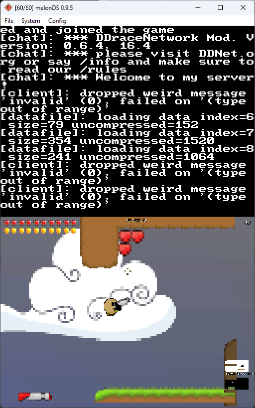

# ddnet-nds

Port of DDNet 9 to the Nintendo DS

To compile, install [BlocksDS SDK](https://blocksds.github.io/docs), then run `make`.

This still has a lot of bugs. It doesn't run on a regular DS most likely due to lack of memory (RAM).
To run this you must use a modded DSi/3DS, or set melonDS emulation mode to DSi

